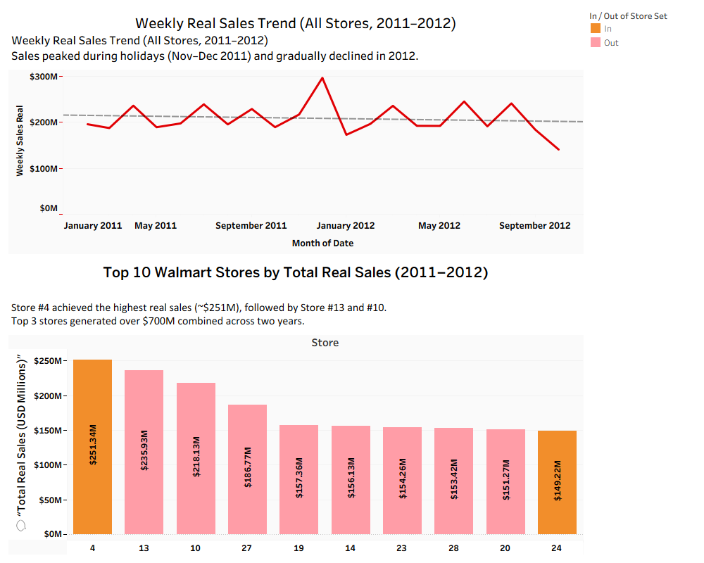

# 🛒 Walmart Sales Forecasting & Dashboard Project





## 📘 Overview
This project analyzes **Walmart’s weekly sales data** to forecast future sales and identify key business drivers.  
It combines **Python Machine Learning models** with **Tableau visualizations** to provide both predictive and descriptive insights.  

The end-to-end workflow includes:
- Exploratory Data Analysis (EDA)
- Feature Engineering
- Model Baseline & Improvement (XGBoost)
- Tableau Dashboard for visualization

This project was designed as a **data analytics portfolio** piece, demonstrating practical skills in  
📊 *Python · Machine Learning · XGBoost · Tableau · Data Storytelling*

```

## 📂 Project Structure


BusinessAnalyticProject/
│
├── data/ # Processed datasets
├── notebooks/ # Jupyter Notebooks
│ ├── Analysis_Walmart_EDA.ipynb
│ ├── Feature_Engineering.ipynb
│ ├── Model_Baseline.ipynb
│ └── Model_Tuning_XGBoost.ipynb
│
├── reports/ # Exported reports
│ ├── Analysis_Walmart_EDA_Template.html
│ ├── Feature_Engineering.html
│ ├── Model_Baseline.html
│ └── Model_Tuning_XGBoost.html
│
├── Tableau_prep/ # Data preparation flow
│ └── Walmart_Prep_Flow.tflx
│
├── Tableau_dashboard/ # Tableau packaged workbook
│ └── Walmart_Sales_Insights.twbx
│
├── exports/ # Image exports (for README)
│ └── Walmart_Sales_Insights_Dashboard_2011_2012.png
│
├── README.md
└── LICENSE


```

## 🚀 Project Workflow

### 1️⃣ Exploratory Data Analysis (EDA)
- Analyzed weekly trends and store-level patterns  
- Compared **Holiday vs. Non-Holiday Weeks**  
- Correlated external factors: *CPI, Fuel Price, Unemployment*  
📄 Report → [`Analysis_Walmart_EDA_Template.html`](reports/Analysis_Walmart_EDA_Template.html)

---

### 2️⃣ Feature Engineering
- Created date features (`Year`, `Month`, `Quarter`, `DayOfWeek`)  
- Added seasonality (`Month_sin`, `Month_cos`, `Peak_Season_Flag`)  
- Generated lag & rolling statistics (`lag1`, `rollmean8`, etc.)  
📄 Report → [`Feature_Engineering.html`](reports/Feature_Engineering.html)

---

### 3️⃣ Model Baseline (XGBoost)
- Train/Test split: 2010–2011 (train), 2012 (test)  
- **RMSE:** 97,804 · **MAPE:** 6.40%  
- Top predictors:
  - `Store_avg_to_date`
  - `Weekly_Sales_Real_rollmean8`
  - `CPI_lag1`  
📄 Report → [`Model_Baseline.html`](reports/Model_Baseline.html)

---

### 4️⃣ Model Improvement (Hyperparameter Tuning)
- Tuned with `GridSearchCV` + `TimeSeriesSplit`
- Compared **XGBoost**, **RandomForest**, and **LightGBM**
- MAPE improved by ~0.34%  
📄 Report → [`Model_Tuning_XGBoost.html`](reports/Model_Tuning_XGBoost.html)

---

### 5️⃣ Tableau Dashboard
**Goal:** Visualize business insights for decision-making

**Files:**
- 📁 `Tableau_prep/Walmart_Prep_Flow.tflx`
- 📁 `Tableau_dashboard/Walmart_Sales_Insights.twbx`
- 🖼️ `exports/Walmart_Sales_Insights_Dashboard_2011_2012.png`

**Dashboard Highlights:**
- *Line Chart:* Weekly Real Sales Trend (2011–2012)  
- *Bar Chart:* Top 10 Stores by Total Real Sales  
- *Insight:*  
  > Store #4 achieved the highest real sales (~$251M), followed by Store #13 and #10.  
  > Sales peaked during holidays (Nov–Dec 2011) and declined in 2012.

📊 Tableau Export Preview:  


---

## 🧠 Business Insights
- Holiday periods significantly boost sales volume  
- CPI and Fuel Price influence sales across stores  
- Model underperforms slightly during high-demand seasons (e.g., Black Friday)  
- Consistent stores with strong historical performance forecast more accurately  

---

## 🧾 Next Steps
- Add promotion-related or holiday indicators  
- Explore deep learning models (LSTM/Prophet)  
- Automate Tableau updates via Python API  
- Deploy interactive dashboard using Tableau Public  

---

## 🧰 Tools & Technologies
| Category | Tools |
|-----------|--------|
| Language | Python |
| Libraries | Pandas, NumPy, Scikit-learn, XGBoost, LightGBM |
| Environment | JupyterLab / Anaconda |
| Visualization | Tableau, Matplotlib, Seaborn |
| Version Control | Git & GitHub |

---

## 👤 Author
**Siripaiboon Janpetch (Flame)**  
🎓 M.S. in Data Analytics, The University of Texas at San Antonio  
📍 Focus: Business Analytics, Forecasting, and Retail Data Science  
🔗 [LinkedIn](https://www.linkedin.com/in/siripaiboon-janpetch) · [GitHub](https://github.com/FlameSJ2000)

